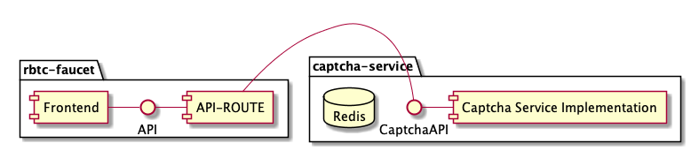

# RBTC Faucet

## Description

Faucet to dispense test RBTC for RSK Testnet.

## Architecture



## Setup -config.json variables

There are 3 differents environments, production, development and testing, each one has a specific -config.json file 

- Production: `prod-config.json`
- Development: `dev-config.json`
- Testing: `test-config.json`

Please check `-config.json` and fill them with right values.

```json
{
  "RSK_NODE": "NODE_URL", 
  "API_URL": "API_FETCH_URL",
  "NEW_CAPTCHA_URL": "http://rust-captcha.com/new/easy/5/998",
  "SOLVE_CAPTCHA_URL": "http://rust-captcha.com:8080/solution/",
  "CAPTCHA_API_URL": "http://rust-captcha.com:8080",
  "FAUCET_ADDRESS": "ADDRESS",
  "FAUCET_PRIVATE_KEY": "PRIVATE_KEY",
  "GAS_PRICE": 60000000,
  "GAS_LIMIT": 800000,
  "VALUE_TO_DISPENSE": 0.001,
  "TAG_MANAGER_ID": "GTM-XXXXXXX"
}
```

**NEW_CAPTCHA_URL** is the url where you're gonna request a new captcha, **SOLVE_CAPTCHA_URL** is for checking the solution and **CAPTCHA_API_URL** is where the captcha-api is hosted, to get more info please read [this README](https://github.com/rsksmart/rust-captcha/blob/master/README.md).

## Running development environment

Open a terminal at root folder.

1. First install depenecies

```bash
yarn
```

2. Then run app 

```bash
yarn dev
```

## Production deploy

Checkout Next.js [tutorial](https://nextjs.org/learn/basics/deploying-a-nextjs-app/deploying-to-your-own-environment) or [docs](https://nextjs.org/docs#production-deployment)

## Debugging with VS Code

Next.js can be started in debug mode by using the `--inspect` flag like regular Node processes. Remember to start your `next` process with this flag, as VS Code otherwise won't be able to connect to your Node process and debug your server-side code. The following *launch.json* sets this flag for you, but if you start your Next process in different way, remember to add this flag.

In order to debug with VS Code debugger, setup you *.vscode/launch.json* like this

```js
// At .vscode/launch.json

{
    "version": "0.2.0",
    "configurations": [
        {
            "type": "node",
            "request": "launch",
            "name": "Next: Node",
            "runtimeExecutable": "npm",
            "runtimeArgs": [
                "run-script",
                "debug"
            ],
            "port": 9229,
            "console": "integratedTerminal"
        }
    ]
}
```

Create a debug script at *package.json* and setup `NODE_OPTIONS` with `--inspect` flag.

```js
// At package.json

{
    "scripts": {
        "debug": "NODE_OPTIONS=--inspect next"
    }
}
```

To get detailed info, please go to [this](https://github.com/microsoft/vscode-recipes/tree/master/Next-js) site.